# 📚 Documentación: Firebase Studio - Análisis Integral del Entorno

Este repositorio contiene un **análisis detallado de mi experiencia** con el entorno de desarrollo de Firebase Studio.

El contenido principal es un desglose de cuatro flujos clave para iniciar un proyecto: 
**Generación con IA**, 
**Plantillas HTML**, 
**Plantillas React** e 
**Importación de Repositorio**. 

Se revisan a fondo las **Tecnologías por Defecto (Stack)** que la plataforma configura automáticamente para cada caso, incluyendo Next.js, Tailwind CSS y Vite.
Cada uno de estos proyectos se encuentran en la plataforma de Firebase Studio, asi como tambien esta een la plataforma de Github.

## 🌐 Estatus de los Proyectos Documentados

Es importante destacar que todos los proyectos utilizados como ejemplos en este análisis (Nomenthos Yoga, Yoga_App, MiAppDeTareas y Firebase_Mobile_First) **se encuentran alojados en la plataforma de Firebase Studio**.

Adicionalmente, estos proyectos están **disponibles en la plataforma de GitHub**, lo que refuerza la capacidad de Firebase Studio para mantener una sincronización bidireccional entre su entorno de desarrollo y los repositorios externos de control de versiones.
---

### Nota Importante sobre el Estudio

*Aunque Firebase Studio ofrece una variedad más amplia de plantillas y lenguajes, este análisis se limitó estratégicamente a estos cuatro flujos principales para estudiar y documentar las configuraciones por defecto de la plataforma.*
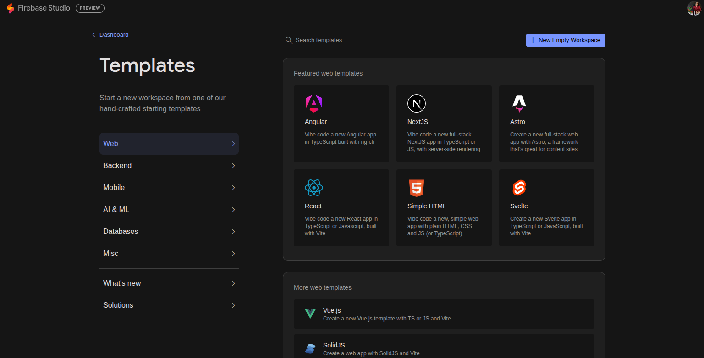

# 🔥 Firebase Studio: El Espacio de Trabajo Full Stack Impulsado por IA
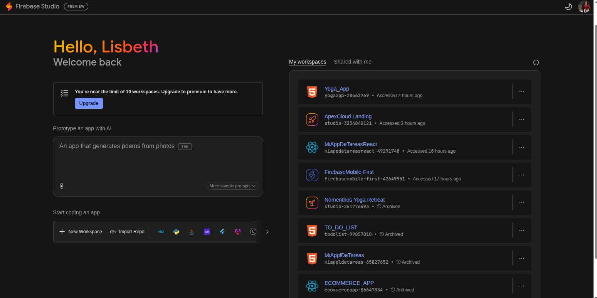

## Introducción a Firebase Studio
Firebase Studio es un entorno de desarrollo asistido por inteligencia artificial que te permite crear y modificar aplicaciones web de forma conversacional, a traves de un prompt.
En lugar de escribir todo el código manualmente, puedes solicitar a la IA que realice los cambios. La IA es un compañero de programación experto que nos ayuda a construir la aplicación más rápido, usando tecnologías modernas como Next.js, React, Tailwind CSS y, por supuesto, Firebase.

**Firebase Studio** se posiciona como un **creador de aplicaciones de IA basado en la web** y un **espacio de trabajo de Full Stack**. Es una herramienta intuitiva que acelera el ciclo de desarrollo al integrar agentes de Inteligencia Artificial (IA) (como Géminis 2.5 Pro).Permitiendo a cualquier persona crear aplicaciones web y móviles de manera conversacional.
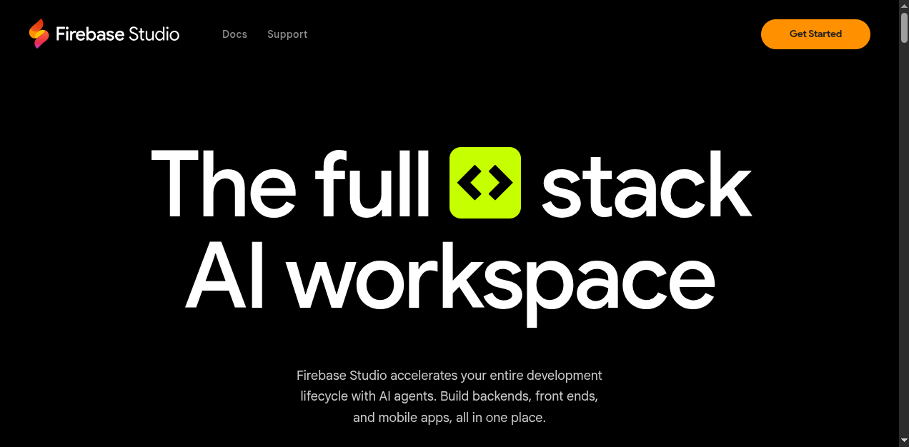
Gracias a su construcción sobre la plataforma **Firebase**, es capaz de gestionar *backends*, *frontends* y aplicaciones móviles, solucionando el problema de la falta de autenticación y bases de datos que tienen otros creadores de aplicaciones de IA.

## Características Clave y Modelo de Uso

* **IA Full Stack:** Cubre tanto el **frontend** (construido con Next.js y React) como el **backend** (lógica del servidor, base de datos Firestore y autenticación con Firebase Auth). Esto aborda el principal problema de otros creadores de apps: la gestión de funciones de backend.

* **Producto de Google:** Genera grandes expectativas al ser el primer generador de apps de IA financiado por una empresa tecnológica de esta magnitud.

* **Flexibilidad de Inicio:** Permite a los usuarios avanzados no solo crear apps desde cero, sino también:
    * **Importar un repositorio**.
    * Programar directamente en lenguajes como **Python** o **Java**.
    * Usar programas como **Android Studio** para aplicaciones Android y Flutter.

## Modelo de precios y Limitaciones

* **Gratuito:** Firebase Studio se comercializa como **gratuito.**
* **Limittaciones de Proyectos:** El número máximo de proyectos que se pueden crear en la versión gratuita es de  **10 por usuario.**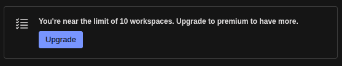
* **Uso Productivo de Firebase:** Firebase en sí mismo **no es un servicio gratuito en modo productivo**. Sí una aplicación necesita sobrepasar los límites diarios o las cuotas gratuitas de peticiones de servicios (como Firestore, etc.), el desarrollador debe implementar estrategias para disminuir esas peticiones o, eventualmente, **migrar a un plan de pago**, ya que Firebase no es ilimitado.
---

## 🛠️ Opciones de Entorno y Configuraciones por Defecto
(assets/Templates.png)
Firebase Studio ofrece varios templates (plantillas) para iniciar un proyecto, o espacio de trabajo, cada uno con tecnología pre-establecida.Para los proyectos que genere durante mi experiencia utilice las siguientes plantillas:

### 1. Generación de Prototipos con IA (Método por defecto)

* **Uso:** Al describir la aplicación con un *prompt* o adjuntar una imagen de inspiración, la IA configura un entorno optimizado.
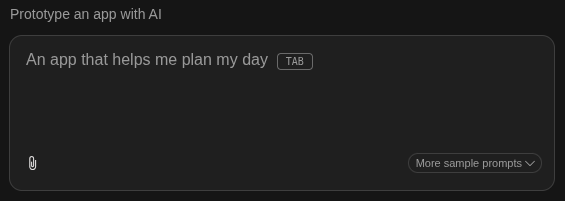

* **Tecnologías por Defecto** utilizadas para este proyecto: **Next.js**, **React**, **TypeScript**, **Tailwind CSS**, **ShadCN UI** (Componentes), **Genkit** (Integración de IA) y **Firebase** (Backend).
* **Nombre del proyecto realizado en este espacio de trabajo:** Nomenthos Yoga.
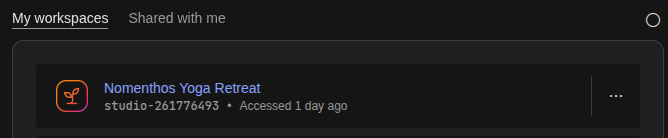

### 2. Plantilla de Inicio: Simple HTML
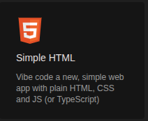

* **Uso:** Ideal para sitios estáticos (*framework-less*), priorizando estándares web nativos y alto rendimiento.

* **Tecnologías por Defecto:** **HTML Semántico**, **CSS Moderno** (con enfoque Mobile First) y **JavaScript "Vanilla"** (ES6+).
* **Nombre del proyecto realizado con esta plantilla:** Yoga_App.
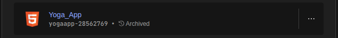

## 💡 Un Flujo de Trabajo Colaborativo e Iterativo

El desarrollo de esta Yoga_App, se realizó bajo un modelo **colaborativo e iterativo**. La IA, utilizando el **prompt** y la **imagen adjunta**,generó el prototipo inicial. Posteriormente, el proceso consistió en **adaptar el diseño a mi criterio**, ajustando y mejorando la funcionalidad. Esta adaptación fue un **ciclo continuo de consulta:** se realizaban modificaciones, se ajustaban las adaptaciones, y ante cualquier problema técnico, **consultaba a la IA** para obtener soluciones específicas.

**prompt:** Me puedes ayudar a maquetar de forma responsiva en HTML y CSS la interfaz de la imagen adjunta, puedes colocar otras imagenes relacionadas a yoga asi como sus accsesorios puedes incluir paisajes naturalez parques, montaña y mar.

**imagen adjunta:**

### 3. Plantilla de Inicio: React
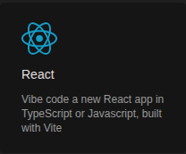

* **Uso:** Para proyectos que requieren una librería moderna de interfaz de usuario (SPAs).
* **Tecnologías por Defecto:** **React** (Componentes y Hooks), el compilador **Vite**, **JavaScript (JSX)** y **CSS Plano**.
* **Nombre del proyecto realizado con esta plantilla:** MiAppDeTareas.
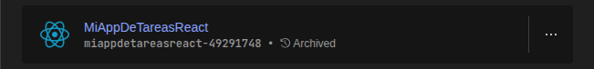

## 💡 Desarrollo Iterativo en Plantilla React

"El proyecto **MiAppDeTareas**, iniciado con la **Plantilla de React**, no fue un desarrollo puramente manual. Se procedió de manera idéntica al flujo de la Generación de Prototipos con IA:
1.  Se utilizó el *template* de React como base inicial.
2.  La personalización y las adaptaciones de diseño y funcionalidad se gestionaron mediante la **consulta continua a la IA** (a través de *prompts*), lo que permitió resolver problemas técnicos y modificar el código generado por el *template* de manera ágil.
Este enfoque demostró que la colaboración con la IA es un elemento central en Firebase Studio, independientemente del método de inicio."

### 4. Importación de Repositorio (Import Repo de GitHub)
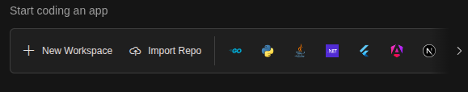
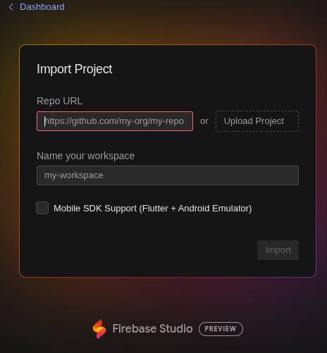

* **Uso:** Para trabajar con repositorios existentes desde **GitHub**,**Gitlab**,**Bitbucket** o **mi computadora local**.
* **Adaptabilidad:** El entorno **se adapta** a las tecnologías del repositorio importado, sin imponer un *stack* por defecto. Por ejemplo, sí es un proyecto de **React**, trabajarás con React; sí es un proyecto de **Angular**, **Vue**, **Svelte** o incluso una página **HTML estática**, usará las herramientas apropiadas para esa tecnología.

* **Personalización Avanzada (`dev.nix`):** Existe una opción para crear un archivo de configuración llamado **`dev.nix`**. Este archivo permite al usuario especificar versiones exactas de herramientas (como Node.js), bases de datos o cualquier otro requisito de *software*. Al crear o modificar este archivo, el entorno de desarrollo se "reinstala" o "reconstruye" para aplicar esos cambios específicos y asegurar la compatibilidad.

* **Nombre del proyecto realizado con esta plantilla:**
Proyecto que se importo desde GitHub :  
https://github.com/polidorl/Responsive-Design-Mobile-First/settings/pages

Nombre del proyecto en la plataforma de Firebase Studio: Firebase_Mobile_First

### ⭐ Nota sobre Estilado y Flexibilidad (Opciones de las plantillas 2 y 3)

Existe una poderosa capacidad de personalización en los entornos de Plantilla de Inicio (**Simple HTML** y **React**).

* Es posible indicarle al **asistente de IA** que utilice frameworks de estilado como **Tailwind CSS** o **Bootstrap** desde el inicio del desarrollo.
* La IA se encargará de **configurar y aplicar la tecnología deseada** en el proyecto, **conservando** el resto de la pila tecnológica por defecto de la plantilla seleccionada (es decir, HTML/CSS Puro en el caso 2, o React/Vite en el caso 3).

## ✅ Síntesis Final: Adaptabilidad y Control

Firebase Studio está diseñado para adaptarse a **cualquier flujo de trabajo**, ofreciendo una **flexibilidad de inicio inigualable** que acelera el desarrollo para todos los perfiles de usuario.

* **Creación Rápida por IA:** La plataforma permite generar nuevas aplicaciones de manera conversacional, utilizando el agente de prototipado. Este acepta **lenguaje natural**, **maquetas**, **herramientas de dibujo** o **capturas de pantalla** para iniciar el proyecto.
* **Inicio Estructurado:** Alternativamente, el usuario puede elegir entre un amplio catálogo de **plantillas** basadas en *frameworks* o lenguajes populares, como React o HTML.
* **Control Avanzado (Nix):** Finalmente, la capacidad de personalizar el entorno con **Nix** asegura que los desarrolladores con requisitos específicos puedan configurar versiones exactas de herramientas (Node.js, bases de datos, etc.), manteniendo el **control total** sobre su pila tecnológica.